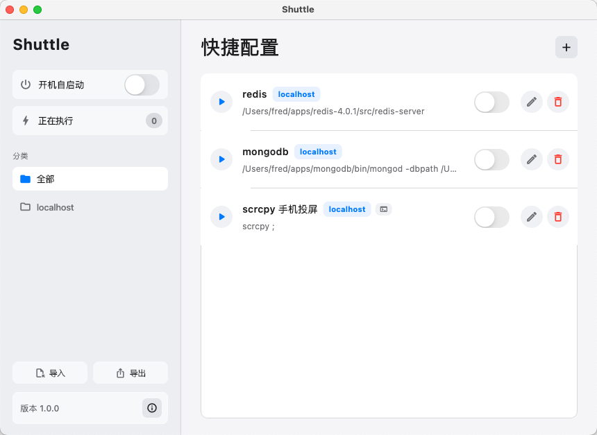
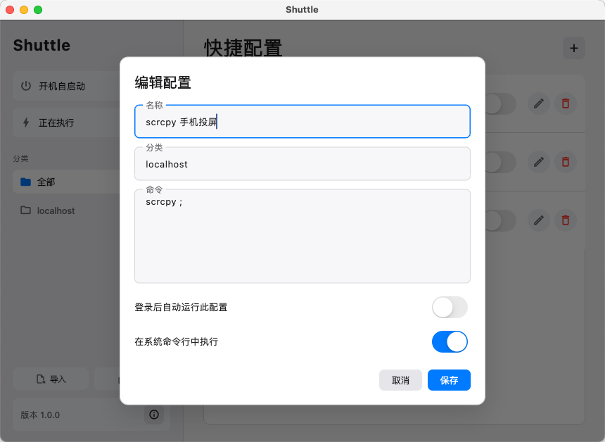

# Shuttle

Shuttle is a macOS-first Flutter desktop app for managing and running frequently used command-line shortcuts from a menu bar app.

The project is inspired by [fitztrev/shuttle](https://github.com/fitztrev/shuttle), rebuilt with Flutter and native macOS integrations.


## Preview





## Features

- macOS menu bar app
  - Lives in the system menu bar beside Wi-Fi, battery, and clock.
  - Uses the product app icon in the menu bar.
  - Does not show a Dock icon.
  - The menu bar dropdown shows currently running background tasks.
  - Provides an entry to reopen the management window.

- Command configuration management
  - Add, edit, and delete command configurations.
  - Delete actions require confirmation.
  - Each configuration contains:
    - Name
    - Category
    - Command
    - Run after login option
    - Run in Terminal option
  - Command editor defaults to a 6-line input area.

- Category management
  - Configurations can be grouped by category.
  - Sidebar category filtering is supported.
  - Adding a new configuration while a category is selected uses that category by default.

- Background command execution
  - Run commands directly from the main window.
  - Background tasks show a running state.
  - Running tasks can be stopped from the same button.
  - The sidebar Running filter shows only currently running background tasks.

- Terminal execution mode
  - Configurations can optionally run in the system Terminal.
  - When enabled, Shuttle opens a new Terminal window and executes the command there.
  - Terminal-run commands are not monitored by Shuttle and are not shown as running tasks.

- Launch at login
  - Global launch-at-login toggle, disabled by default.
  - Per-configuration run-after-login toggle, disabled by default.
  - When Shuttle starts at login, enabled configurations run automatically.

- Import and export
  - Export all configurations to a JSON file.
  - Import configurations from a JSON file.
  - Useful for moving to a new Mac or restoring after reinstalling.

- Localization
  - Supports English and Chinese.
  - Follows the current system language.
  - Falls back to English for unsupported languages.

- Native macOS behavior
  - Native menu bar integration.
  - Native open/save panels for import and export.
  - Native browser opening for About.
  - Minimum window size to prevent layout overflow.

## Configuration Storage

Configurations are stored locally at:

```text
~/Library/Application Support/FlutterShuttle/config.json
```

The exported configuration file uses the same JSON structure, so it can be imported on another machine.

## Build

Build the macOS debug app:

```bash
flutter build macos --debug
```

The generated app is:

```text
build/macos/Build/Products/Debug/Shuttle.app
```

## Run

For normal usage, open the built app directly:

```bash
open build/macos/Build/Products/Debug/Shuttle.app
```

Because Shuttle is a menu bar app, `flutter run -d macos` may report foregrounding warnings. Running the built `.app` gives behavior closer to the final product.

## Development Checks

Common checks:

```bash
dart format lib/main.dart test/widget_test.dart
flutter analyze
flutter test
flutter build macos --debug
```

## Platform Status

- macOS: primary target, implemented first.
- Windows/Linux: project scaffolding exists, but Shuttle-specific native integrations are currently focused on macOS.


## Flutter 3.38.9

```
Flutter 3.38.9 • channel stable • https://github.com/flutter/flutter.git
Framework • revision 67323de285 (5 months ago) • 2026-01-28 13:43:12 -0800
Engine • hash 5eb06b7ad5bb8cbc22c5230264c7a00ceac7674b (revision 587c18f873) (4 months ago) • 2026-01-27 23:23:03.000Z
Tools • Dart 3.10.8 • DevTools 2.51.1
```